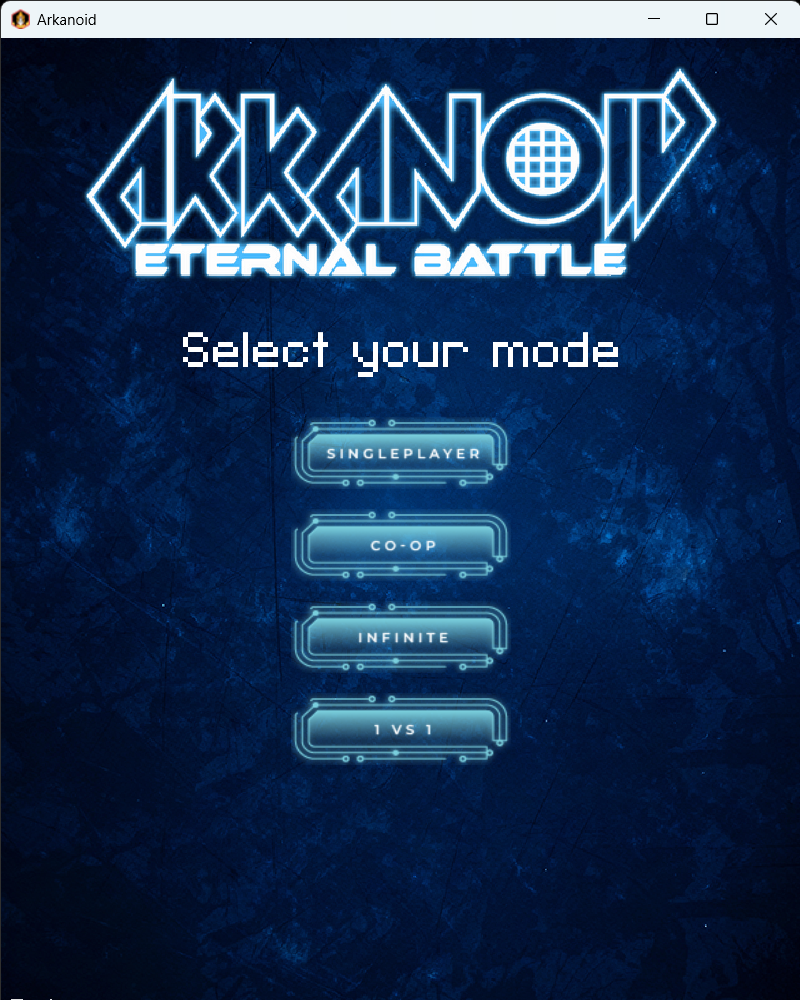
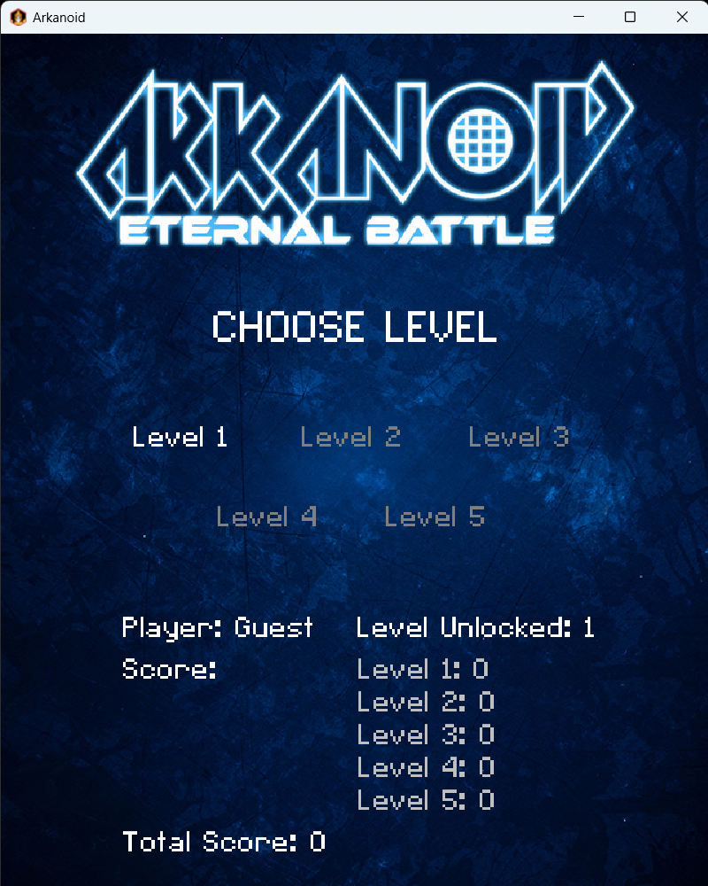
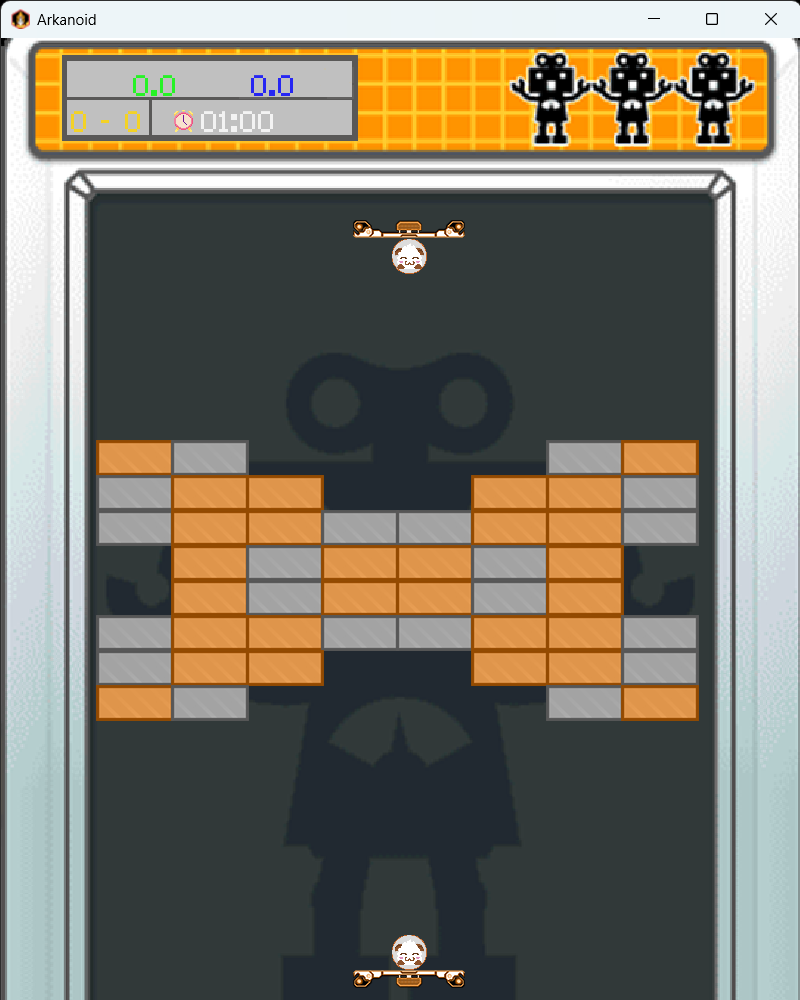
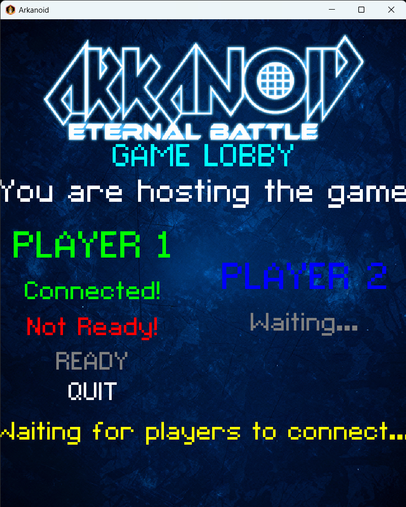
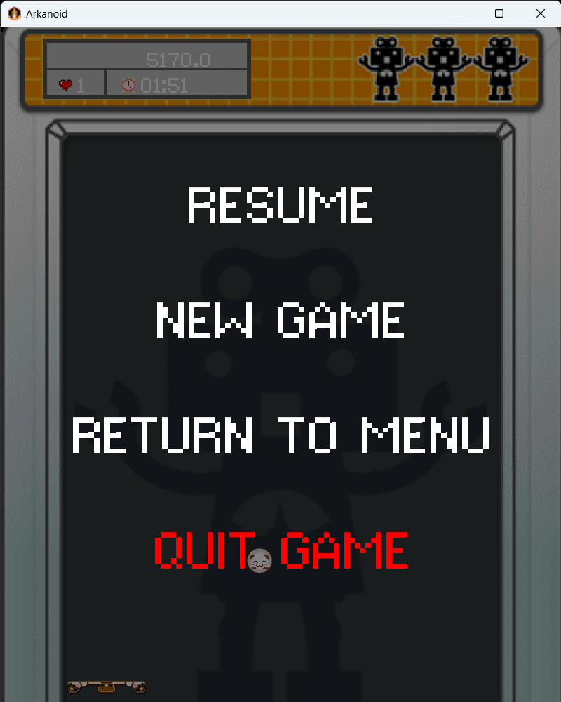

# Arkanoid
*OOP UET-VNU course project*

## Structure
### InheritanceScheme

### InnerClasses

---

## Demo
https://youtu.be/TQ6qKUCGiIw?si=_pTVADwaeZTc5Qy6
https://youtu.be/tgq3tLdrxCE?si=g8I68lqW54glUy5o

---

## Key Features
### Five Game Modes: LevelMode, CoopMode, InfiniteMode, VsMode, and NetworkVsMode

### Sequential Level Unlocks (LevelMode)
* Players must complete levels in order to unlock new ones.

### Local Co-op (CoopMode)
* Two players play together on the same machine and level unlocks.

### Local Versus (VsMode)
* Two players compete against each other on the same machine.

### Endless Challenge (InfiniteMode)
* Play through unlimited levels with gradually increasing difficulty.
### Network Versus (NetworkVsMode)
* Two players compete on separate machines over a network connection.

### SQL-based Achievement Saving
* Uses SQL to save and manage player high scores and achievements.
### Resume on Relaunch
* Saves the game state when the player exits, allowing them to continue later.

### Dynamic Bricks
* Features **Moving Bricks** that traverse the map and **Explosive Bricks** that detonate adjacent bricks.
---

## Improvements

* Added new brick types: **Explosive Brick** and **Moving Brick**.
* Added 5 new effects: `RemoveEffect`, `StunPaddleEffect`, `FastBallEffect`, `RandomEffect`, and `UnbreakBrickEffect`.
* Implemented game state saving (on exit) using `GameSaveManager` and `GameData`.
* Refactored collision handling with a new `CollisionManager`.
* Centralized in-game input processing into `IngameInputHandler`.
* Developed a network multiplayer mode (based on `VsMode` logic) using the **Kryonet** library.
* Added sound effects and music to the game.
* Implemented player achievement saving using `CoopDataHandler` and `LevelDataHandler`.
* Added pause functionality (`PauseUI`), a post-game summary screen (`GameSummaryScreen`), and game over flows (`GameOver`).

---

## Contributors

* **Nguyen Quang Linh**
    * Implemented **LevelMode** and related menus (`LevelSelectionMenu`, `SinglePlayerLevelSelectionMenu`).
    * Handled game **pause** and **resume** functionality.
    * Implemented the game **saving** feature (`GameSaver`).
    * Laid the foundation for saving player achievements (`DataHandler`, `BaseLevelDataHandler`).
    * Created and managed effects: `FastBall`, `Random`, `Remove`, `Shield`, `SlowBall`, `StunPaddle`, `UnbreakBrick`.
    * Developed the **Pause UI** (`PauseUI`).
    * Implemented **Moving Bricks** (using DSU for logic).
    * Handled **Explosive Bricks** logic.

* **Nguyen Tuan Huy**
    * Developed the **Game UI**: Created stages for menus and settings (`MainMenu`, `Settings`, `ModeSelection`, `UserInterface`, `GameScreen`, `GameSummaryScreen`, etc.).
    * Sourced and managed **visual assets**: skins/images for buttons, bricks, paddles, game icons, effect icons, and bitmap fonts.
    * Sourced and managed **audio assets**: all SFX and background music.
    * Implemented **collision handling**: Developed the `CollisionManager` and integrated it into all game modes.
    * Managed **player input**: Developed the `IngameInputHandler` and applied it across game modes.
    * Implemented the **Co-op Mode** (`CoopMode`).

* **Duong Hai Khoi**
    * Implemented **VsMode** and `NetworkVsModeLogic`.
    * Modified ball and shield effects to be player-specific (for multiplayer).
    * Implemented the `ScoreManager`.
    * Created and managed `BigBallEffect` and `ExpandEffect`.
    * Implemented the `TextureManager` class.
    * Laid the foundation for core classes: `MovableObject`, `Ball`, and `Paddle`.

* **Pham Tran Hieu**
    * Implemented the **InfiniteMode**.
    * Implemented achievement saving for Infinite Mode (`InfiDataHandler`).
    * Implemented `LeaderBoard` and `Player` classes.
    * Created and managed the `ThreeBallEffect`.
    * Implemented the `ModeMenu`.
    * Laid the foundation for base classes: `GameObject`, `BrickMap`, `Brick`, `EffectItem`, `EffectFactory`, `GameMode`, and `Main`.
    * Implemented the main `Game` class to manage game states.
    * Implemented **NetworkVsMode** and the core **networking system** (`NetworkProtocol`, `GameServer`, `GameClient`, `GameClientListener`, `NetworkConnectionMenu`, `NetworkLobby`, `NetworkUtils`).
    * Set up **Unit Tests** using JUnit.
