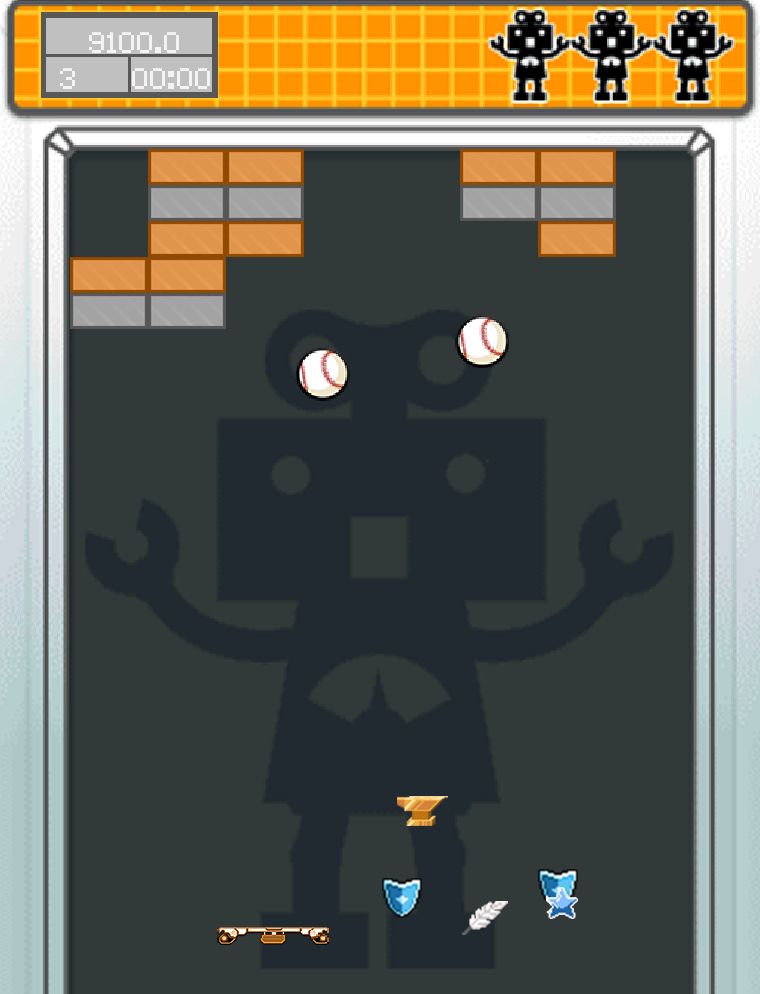
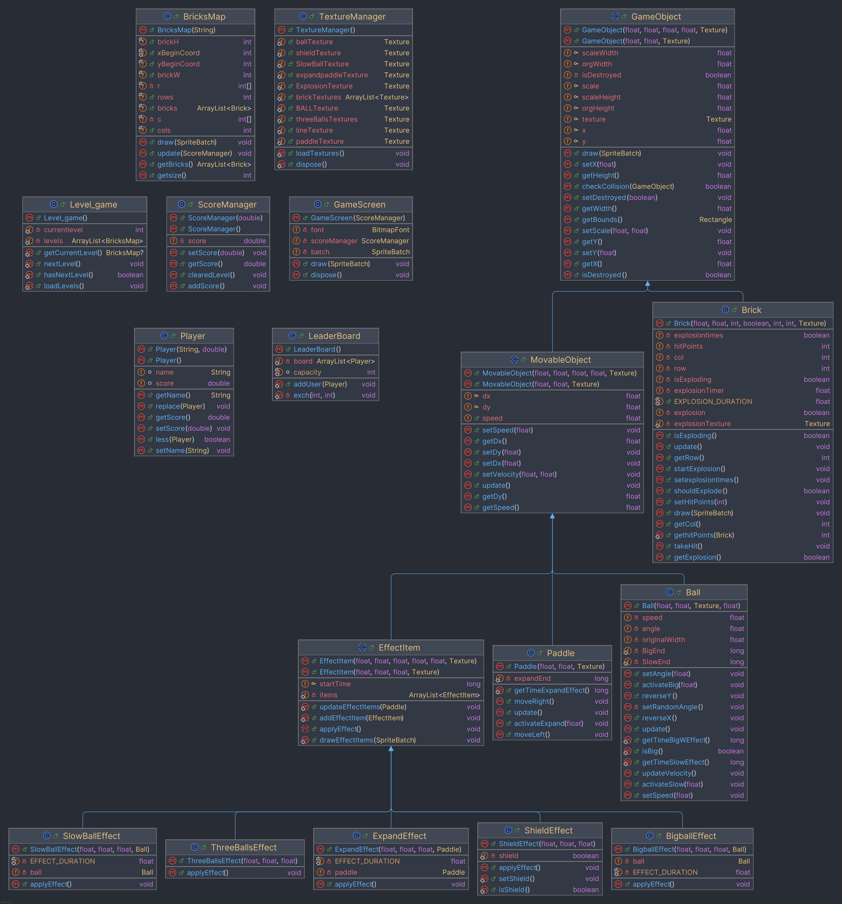

# Arkanoid
*OOP UET-VNU course project*
## Version: Week6

**Demo**

**Structure**

**Improve**
- Add more PowerUp effect `BigballEffect`, `ShieldEffect`, `SlowBallEffect`
- Calculate and display player scores through `ScoreManager`,`GameScreen`
- Add `Player`, `LeaderBoard` to record player scores and arrange them
- Change images of game objects
- Complete `UI` and `SettingsUI`
## Contributors
- `Nguyen Quang Linh`: implements `BigballEffect`, `ShieldEffect`, `SlowBallEffect`
- `Nguyen Tuan Huy`: completes `UI`,`SettingsUI`and displays player score on `GameScreen`
- `Duong Hai Khoi`: implements `ScoreManager` and calculates player score
- `Pham Tran Hieu`: implements `Player`, `LeaderBoard`
