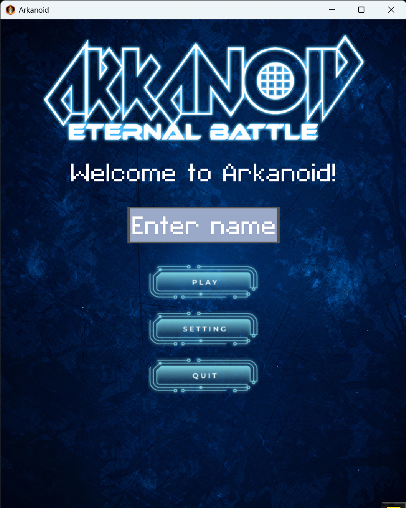
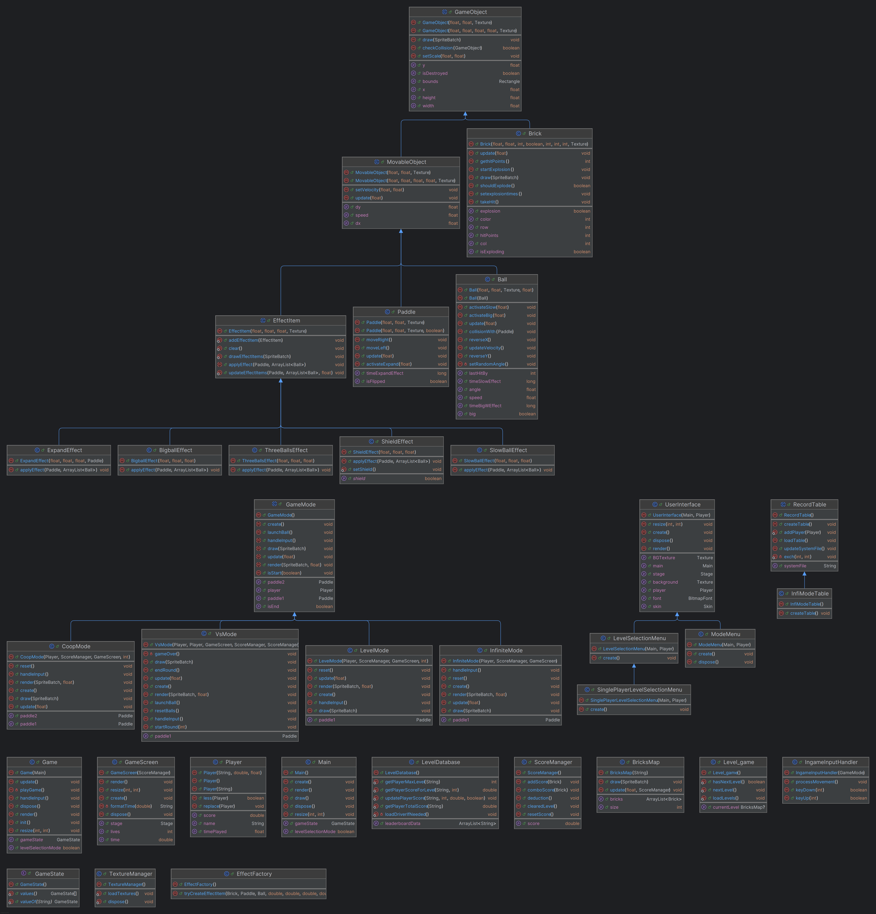

# Arkanoid
*OOP UET-VNU course project*
## Version: Week7

**Demo**

*Main menu*

*Select mode*

**Structure**

**Improve**
- Add 4 game mode: `Infinite Mode`, `Co-op Mode`, `SinglePlayer Mode(Levels)`, `1vs1 Mode`.
- Add `DataHandler` and use `SQL lite` to save player achievement
- Display player achievement
## Contributors
- `Nguyen Quang Linh`: implements `SinglePlayer Mode(Levels)`, use `SQL lite`
- `Nguyen Tuan Huy`: implements `Co-op Mode` and edit user interfaces
- `Duong Hai Khoi`: implements `1vs1 Mode`
- `Pham Tran Hieu`: implements `Infinite Mode` and display player achievement.
